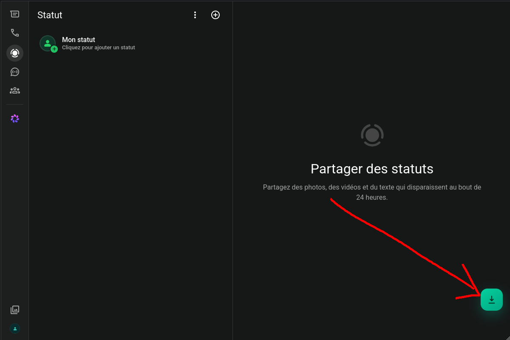
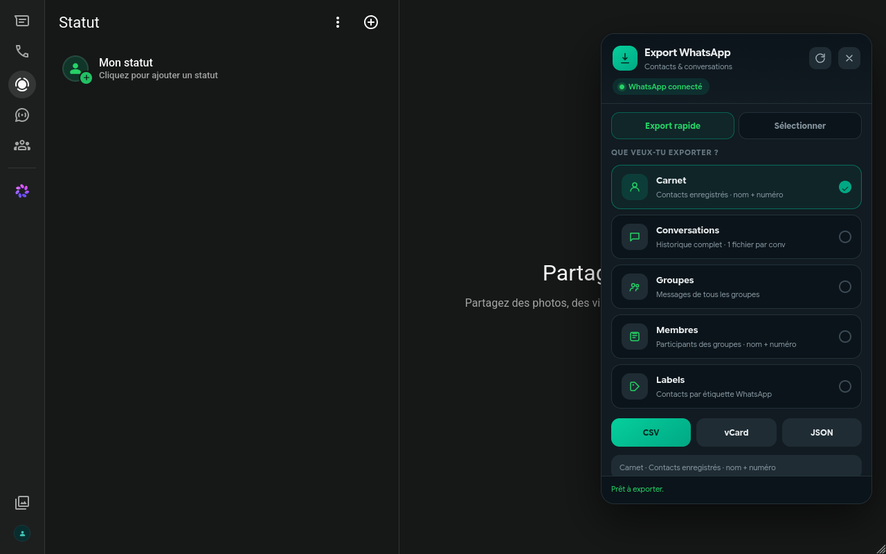

# WhatsAppExporter

A Chrome extension that exports your WhatsApp Web data — address book, full conversations, groups and members, labels — to **CSV**, **vCard**, or **JSON**. One click, no account, nothing leaves your browser.

> **Status: awaiting Chrome Web Store review.** The listing has been submitted and is currently under Google's review (this can take anywhere from a few days to a few weeks for extensions requesting host permissions). Until it's approved, grab the packaged `.crx` from the [Releases](../../releases) page, or install it manually — see [Installation](#installation) below.

## Why this exists

I went looking for a simple WhatsApp contact exporter and found a handful of extensions doing exactly this — reading data that's already sitting in your own browser tab and writing it to a file — locked behind a $5 "premium" paywall, or capped at 10 contacts unless you pay. For a few hundred lines of JavaScript running entirely on your own machine.

That's absurd. So here's a free one. No account, no subscription, no artificial limits, no server, no tracking.

## Screenshots

| Export button | Export panel |
| --- | --- |
|  |  |

## Features

- **Address book** — saved contacts, name + number
- **Conversations** — full message history, one file per chat or one combined file
- **Groups** — messages from all groups, or just the member lists
- **Labels** — contacts grouped by WhatsApp label
- **Formats**: CSV, vCard (`.vcf`), JSON
- **Quick export** (one click, sensible defaults) or **advanced mode** (pick exactly which contacts/chats to include, search, dedupe duplicates)
- **Localized UI** — automatically follows your browser's language (English, French, German), falling back to English otherwise
- Everything runs client-side, in the page you already have open

## Installation

### From the Chrome Web Store
*(Pending review — link added once the listing is live. See the status note above.)*

### From a Release (while waiting for the Web Store)
Download the latest `.crx` from the [Releases](../../releases) page. Note that modern Chrome blocks direct drag-and-drop install of `.crx` files outside the Web Store for security reasons — use it via an enterprise install policy, or just use the manual/unpacked method below for day-to-day use.

### Manual install (unpacked)
1. Download or clone this repository.
2. Open `chrome://extensions` in Chrome.
3. Enable **Developer mode** (top right).
4. Click **Load unpacked** and select this folder.
5. Open [web.whatsapp.com](https://web.whatsapp.com) and log in as usual.

## Usage

1. Open WhatsApp Web and make sure it's fully loaded and connected.
2. Click the green export button in the bottom-right corner of the page.
3. **Quick export**: pick a source (contacts, conversations, groups, members, labels) and a format — done.
4. **Select** (advanced mode): switch tabs to browse contacts/chats/groups/labels, search, check/uncheck individual items, then export just that selection.

Options available in advanced mode:
- **Merge duplicates** — combine entries that resolve to the same phone number
- **Simple CSV** — name + number only, instead of the full column set
- **One file per conversation** — split message exports by chat instead of one combined file

## Privacy

WhatsAppExporter doesn't collect, store, or transmit any data. It reads whatever you ask it to export directly from your own WhatsApp Web session, in memory, and writes it straight to a file your browser downloads to your computer. There's no backend, no analytics, no network requests of its own, and no data ever leaves your device.

Full privacy policy: [PRIVACY.md](PRIVACY.md)

## How it works

The extension injects a small script into the WhatsApp Web page (in the page's own JS context) that hooks into [wa-js](https://github.com/wppconnect-team/wa-js), the same reverse-engineered client library used by several WhatsApp automation projects, to read contacts, chats, groups and labels already loaded by the app. A second content script renders the export UI (a floating panel) and talks to the injected script to build and download the export files. No part of this touches any domain other than `web.whatsapp.com`.

## Repository structure

```
manifest.json          Extension manifest (MV3)
content.js              Export UI (floating panel), runs in the isolated content-script world
injected.js              Reads WhatsApp Web data via wa-js, runs in the page's MAIN world
vendor/wppconnect-wa.js  Bundled wa-js library
_locales/                UI strings (en, fr, de)
icons/                   Extension icons
```

## Disclaimer

WhatsAppExporter is an independent, unofficial tool. It is not affiliated with, endorsed by, or connected to WhatsApp Inc. or Meta Platforms, Inc. Use it on your own account and data, and be mindful of your local laws around exporting other people's personal information.

## License

MIT — see [LICENSE](LICENSE).
